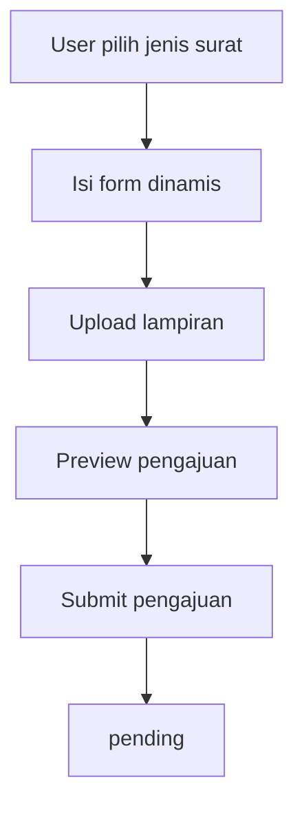
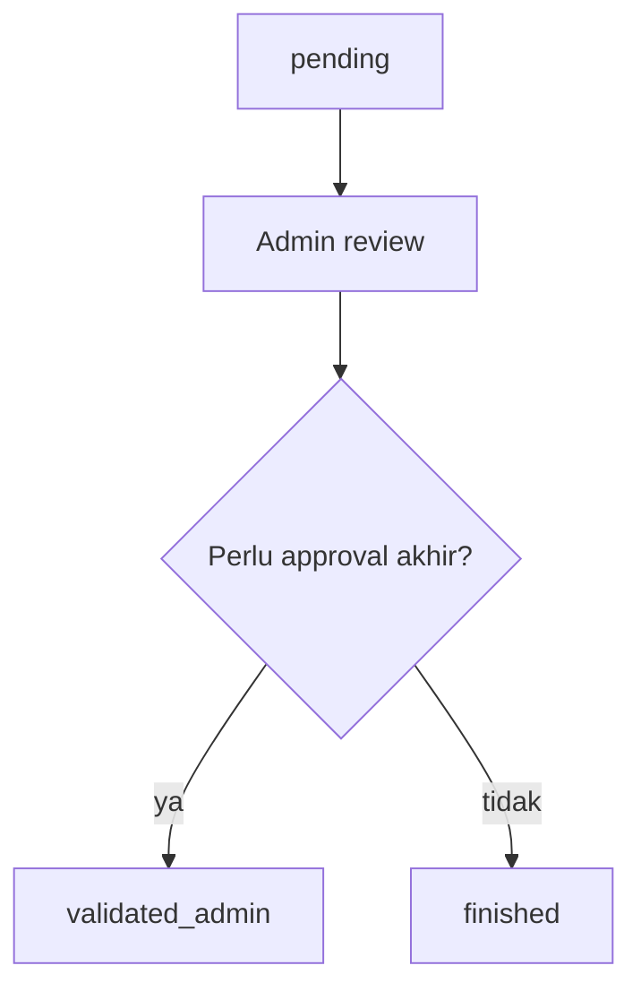
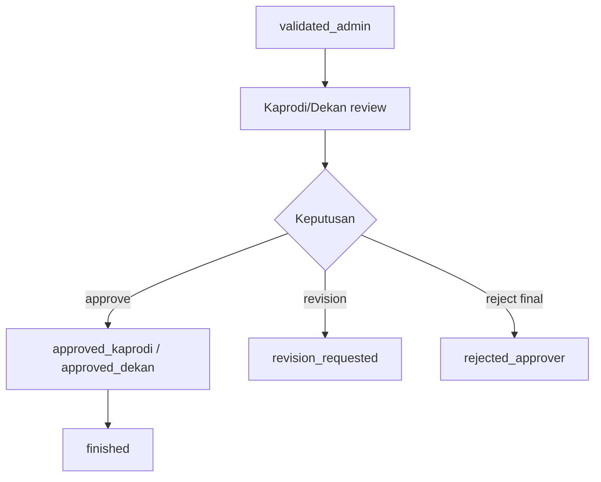
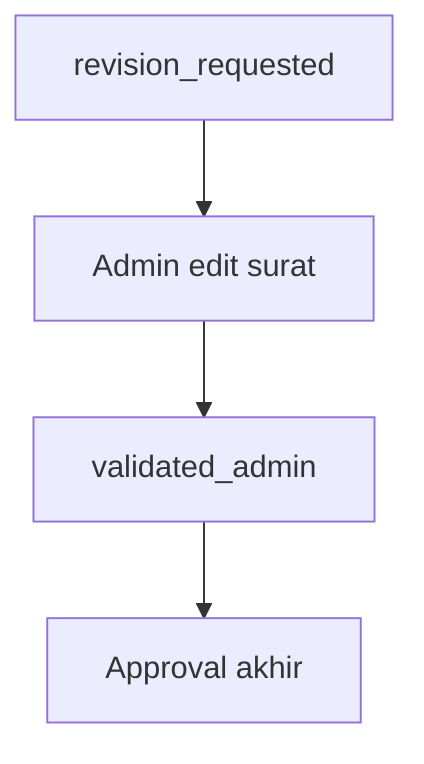
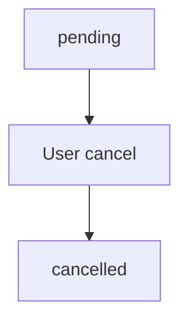
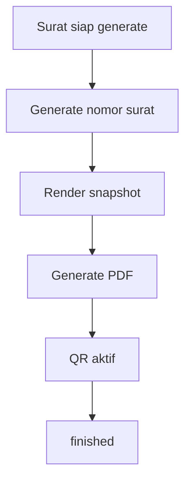

# Acuan Desain UI FAST

Dokumen ini merangkum pola styling UI yang benar-benar dipakai pada modul FAST di repository ini. Tujuannya adalah menjadikan FAST sebagai acuan visual lintas role dan lintas workflow, sekaligus mudah diselaraskan dengan design system WIMS tanpa mengubah business logic.

Catatan audit:
- FAST di repository ini terdiri dari modul pengajuan surat, approval, arsip, template, kategori, QR verification, dan dashboard role-based.
- Halaman role `dosen`, `lab`, dan `sekfak` pada umumnya mewarisi komponen `mahasiswa`, sehingga pola visual dasar mereka sama.
- Role `admin`, `kaprodi`, dan `dekan` memiliki variasi workflow dan detail panel yang lebih kaya.

---

## 1. Design Philosophy

Karakter visual FAST adalah:
- formal
- akademik
- operational
- structured
- document-centric
- readable
- status-driven
- detail-rich

Prinsip visual utamanya:
- Mengutamakan container terang di atas background lembut agar data surat mudah dibaca.
- Menjadikan status, timeline, preview dokumen, dan aksi approval sebagai elemen paling jelas.
- Menghindari tampilan terlalu dekoratif karena konteks FAST adalah layanan administrasi.
- Menjaga hierarchy antara informasi utama, metadata, status, dan action.
- Memberi prioritas pada kejelasan proses surat daripada ornamen visual.

Karena FAST dan WIMS sama-sama berada di ekosistem Portal FMIKOM, maka pendekatan paling aman adalah:
- memakai language visual yang konsisten
- menjaga radius, border, shadow, dan tone warna tetap selaras
- membedakan FAST lewat struktur workflow dan komponen dokumen, bukan lewat gaya visual yang jauh berbeda

---

## 2. FAST Scope

### FAST adalah modul apa?

FAST adalah modul layanan surat dan persetujuan surat di Portal FMIKOM.

### Tujuan bisnis
- memfasilitasi pengajuan surat akademik dan surat keluar
- mengelola validasi admin
- mengelola approval kaprodi dan dekan
- mengelola revisi, penolakan, arsip, dan histori proses
- menyediakan preview dokumen, PDF final, dan verifikasi QR

### Masalah yang diselesaikan
- pengajuan surat yang manual menjadi terpusat
- alur approval menjadi jelas
- dokumen dapat dipreview sebelum dan sesudah generate
- status surat dapat ditelusuri
- riwayat proses surat terdokumentasi

### Aktor yang menggunakan FAST
- Mahasiswa
- Dosen
- Kepala Lab
- Sekretaris Fakultas
- Admin
- Kaprodi
- Dekan

---

## 3. FAST Module Map

### FAST
├── Dashboard
├── Ajukan Surat
├── Riwayat Surat
├── Approval
├── Arsip
├── Surat Masuk / Antrian
├── Surat Keluar / Surat Admin
├── Template Surat
├── Kategori Surat
├── QR Code
├── Preview Dokumen
└── Pengaturan Global

### 3.1 Dashboard

Tujuan:
- menjadi pintu masuk role-based
- menampilkan ringkasan status surat dan aktivitas terbaru

Fitur utama:
- statistik surat
- daftar pengajuan terbaru
- quick action menuju pengajuan atau surat terkait
- preview ringkas untuk dokumen tertentu

Halaman terkait:
- `resources/js/pages/FASt/mahasiswa/Dashboard.vue`
- `resources/js/pages/FASt/admin/dashboard/Index.vue`
- `resources/js/pages/FASt/admin/dashboard/Show.vue`
- wrapper role:
  - `resources/js/pages/FASt/dosen/Dashboard.vue`
  - `resources/js/pages/FASt/lab/Dashboard.vue`
  - `resources/js/pages/FASt/sekfak/Dashboard.vue`

### 3.2 Ajukan Surat

Tujuan:
- membuat pengajuan surat baru oleh pemohon

Fitur utama:
- pilih jenis surat
- isi form dinamis
- upload lampiran
- preview sebelum submit

Halaman terkait:
- `resources/js/pages/FASt/mahasiswa/Ajukan.vue`
- wrapper role:
  - `resources/js/pages/FASt/dosen/Ajukan.vue`
  - `resources/js/pages/FASt/lab/Ajukan.vue`
  - `resources/js/pages/FASt/sekfak/Ajukan.vue`

### 3.3 Riwayat Surat

Tujuan:
- menampilkan histori surat milik pemohon
- menyediakan status, catatan, preview, dan download

Fitur utama:
- filter status
- timeline / progress tracking
- preview dokumen
- download PDF
- batal untuk surat yang masih pending

Halaman terkait:
- `resources/js/pages/FASt/mahasiswa/History.vue`
- wrapper role:
  - `resources/js/pages/FASt/dosen/History.vue`
  - `resources/js/pages/FASt/lab/History.vue`
  - `resources/js/pages/FASt/sekfak/History.vue`

### 3.4 Approval

Tujuan:
- menangani alur approval surat oleh kaprodi dan dekan

Fitur utama:
- antrian approval
- arsip approval
- detail surat
- preview dokumen
- approve
- request revision
- final reject
- catatan approval

Halaman terkait:
- `resources/js/pages/FASt/Shared/approval/Index.vue`
- `resources/js/pages/FASt/Shared/approval/Queue.vue`
- `resources/js/pages/FASt/Shared/approval/Archive.vue`
- `resources/js/pages/FASt/Shared/approval/Download.vue`
- `resources/js/pages/FASt/Shared/approval/Show.vue`

### 3.5 Surat Masuk / Surat Keluar Admin

Tujuan:
- mengelola surat yang dibuat admin, divalidasi, atau diteruskan ke approver

Fitur utama:
- ringkasan surat masuk
- detail surat
- validasi admin
- edit surat revisi
- generate PDF final

Halaman terkait:
- `resources/js/pages/FASt/admin/dashboard/Index.vue`
- `resources/js/pages/FASt/admin/dashboard/Show.vue`
- `resources/js/pages/FASt/admin/letters/Create.vue`
- `resources/js/pages/FASt/admin/letters/Form.vue`
- `resources/js/pages/FASt/admin/letters/Preview.vue`
- `resources/js/pages/FASt/admin/letters/Edit.vue`
- `resources/js/pages/FASt/admin/letters/Index.vue`

### 3.6 Template Surat

Tujuan:
- mengatur struktur template surat dan komponen isi

Fitur utama:
- builder isi surat
- komponen layout
- field dinamis
- placeholder
- pengaturan kop dan footer
- preview template

Halaman terkait:
- `resources/js/pages/FASt/admin/templates/Index.vue`

### 3.7 Kategori Surat

Tujuan:
- mengelompokkan jenis surat

Fitur utama:
- tambah kategori
- edit kategori
- hapus kategori
- urutan kategori

Halaman terkait:
- `resources/js/pages/FASt/admin/categories/Index.vue`

### 3.8 QR Code

Tujuan:
- verifikasi dokumen surat dengan QR token

Fitur utama:
- daftar QR aktif
- preview dokumen
- revoke QR
- form verifikasi token

Halaman terkait:
- `resources/js/pages/qr/Index.vue`
- `resources/js/pages/qr/VerifyForm.vue`
- `resources/js/pages/qr/VerifyResult.vue`

### 3.9 Pengaturan Global

Tujuan:
- mengatur parameter global surat seperti kop, footer, font, dan format nomor

Fitur utama:
- logo kop
- nama instansi dan fakultas
- font kop/body/footer
- layout kop/footer
- format nomor surat

Halaman terkait:
- `app/Http/Controllers/FASt/Admin/GlobalSettingsController.php`
- modal pengaturan di halaman template admin

---

## 4. Role Map

| Role | Deskripsi | Hak Akses Utama |
| ---- | --------- | --------------- |
| Mahasiswa | Pemohon surat utama | Ajukan surat, lihat dashboard, riwayat, preview, download sesuai status |
| Dosen | Pemohon surat akademik | Sama seperti mahasiswa dengan role-based jenis surat |
| Kepala Lab | Pemohon surat untuk unit laboratorium | Sama seperti mahasiswa dengan pembatasan jenis surat tertentu |
| Sekretaris Fakultas | Pemohon surat untuk unit fakultas | Sama seperti mahasiswa dengan pembatasan jenis surat tertentu |
| Admin | Operator surat dan validator awal | Validasi pengajuan, buat surat keluar, edit revisi, generate PDF, kelola template, kategori, QR, pengaturan global |
| Kaprodi | Approver akhir untuk jenis surat tertentu | Approve, request revision, final reject, lihat arsip approval |
| Dekan | Approver akhir untuk jenis surat tertentu | Approve, request revision, final reject, lihat arsip approval |

Catatan:
- `dosen`, `lab`, dan `sekfak` di FE memakai basis halaman yang sama dengan `mahasiswa`.
- `kaprodi` dan `dekan` memakai basis approval yang sama, lalu dibedakan lewat role slug dan route prefix.

---

## 5. Workflow Map

### Workflow 1 - Pengajuan Surat User

Penjelasan:
- workflow ini dipakai oleh mahasiswa, dosen, lab, dan sekfak
- status awal selalu `pending`

### Workflow 2 - Validasi Admin

Penjelasan:
- admin memverifikasi pengajuan awal
- bila jenis surat membutuhkan approver akhir, surat diteruskan
- bila tidak, dokumen dapat langsung selesai digenerate

### Workflow 3 - Approval Kaprodi / Dekan

Penjelasan:
- approval akhir hanya berjalan setelah admin validasi
- revisi mengembalikan surat ke admin
- reject final menutup proses surat

### Workflow 4 - Revisi Admin

Penjelasan:
- admin memperbaiki isi surat setelah catatan revisi dari approver
- surat lalu masuk kembali ke alur approval

### Workflow 5 - Cancel Surat

Penjelasan:
- pembatalan hanya valid ketika surat masih pending

### Workflow 6 - Generate Dokumen Final

Penjelasan:
- preview HTML dipakai untuk review
- PDF final dipakai untuk hasil resmi dan verifikasi QR

---

## 6. Status Map

### Status Surat

| Status | Arti | Digunakan Pada |
| ------ | ---- | -------------- |
| `pending` | Surat baru diajukan, menunggu validasi admin | Dashboard user, dashboard admin, workflow submit |
| `validated_admin` | Admin sudah memvalidasi surat | Approval queue, draft generate, detail surat |
| `revision_requested` | Surat dikembalikan untuk revisi | Riwayat user, detail approval, edit admin |
| `approved_kaprodi` | Disetujui kaprodi | Status akhir approval, dashboard user |
| `approved_dekan` | Disetujui dekan | Status akhir approval, dashboard user |
| `finished` | Surat selesai dan PDF tersedia | Download, preview final, QR aktif |
| `rejected_admin` | Surat ditolak admin | Riwayat user, dashboard admin |
| `rejected_approver` | Surat ditolak final oleh kaprodi/dekan | Riwayat user, approval archive |
| `cancelled` | Surat dibatalkan pemohon | Riwayat user, dashboard user |

### Status Approval Flow

| Status | Arti | Digunakan Pada |
| ------ | ---- | -------------- |
| `approved` | Approval disetujui | Timeline approval |
| `revision_requested` | Diminta revisi | Timeline approval |
| `rejected_final` | Ditolak final | Timeline approval |
| `note` | Catatan approval | Timeline approval |

### Status UI yang paling sering muncul

| Label UI | Sumber Status |
| -------- | ------------- |
| Menunggu Validasi | `pending` |
| Sudah Divalidasi | `validated_admin`, `approved_kaprodi`, `approved_dekan`, `finished` |
| Perlu Revisi | `revision_requested` |
| Ditolak | `rejected_admin`, `rejected_approver` |
| Dibatalkan | `cancelled` |

---

## 7. Dashboard Map

### Dashboard Mahasiswa / Dosen / Lab / Sekfak

Informasi yang ditampilkan:
- ringkasan total surat
- jumlah diproses
- jumlah selesai
- jumlah ditolak
- jumlah dibatalkan
- daftar pengajuan terbaru
- banner revisi bila ada surat yang harus diperbaiki

Action utama:
- ajukan surat
- buka detail riwayat
- preview dokumen
- download PDF ketika tersedia

### Dashboard Admin

Informasi yang ditampilkan:
- ringkasan pengajuan masuk
- status pending / validated / finished / rejected / cancelled
- pengajuan terbaru
- aktivitas surat keluar terbaru

Action utama:
- detail surat
- validasi admin
- preview dokumen
- generate PDF
- buka arsip atau daftar surat

### Dashboard Approval (Kaprodi / Dekan)

Informasi yang ditampilkan:
- queue surat yang perlu disetujui
- arsip approval
- statistik status approval

Action utama:
- buka detail surat
- approve
- request revision
- final reject
- preview dokumen

---

## 8. Form Map

| Form | Tujuan | Jumlah Field | Kompleksitas |
| ---- | ------ | ------------ | ------------ |
| Ajukan Surat User | Membuat pengajuan surat baru | Banyak, dinamis | Complex |
| Form Surat Admin | Membuat surat keluar | Banyak, dinamis + manual | Complex |
| Edit Surat Revisi | Memperbaiki surat yang dikembalikan | Sedang sampai banyak | Complex |
| Template Builder | Menyusun isi template surat | Banyak | Complex |
| Category Form | Kelola kategori surat | Sedikit | Simple |
| QR Verify Form | Verifikasi token QR | Sedikit | Simple |
| Global Settings Form | Atur kop, footer, font, nomor | Sedang | Medium |

---

## 9. Data Presentation Pattern

FAST cenderung memakai kombinasi:
- dashboard card
- detail card
- form card
- timeline card
- table kecil
- modal preview dokumen

Perkiraan pola tampilan:
- 40% card/detail
- 25% form
- 15% timeline / status tracking
- 10% table
- 10% viewer / preview modal

Pola dominan:
- card-based detail view
- timeline untuk approval/history
- preview viewer untuk dokumen
- table hanya saat list data benar-benar padat

---

## 10. Komponen Khas FAST

| Komponen | Ada/Tidak | Lokasi |
| -------- | --------- | ------ |
| Timeline tracking | Ada | Riwayat user, approval detail |
| Progress tracking | Ada | Dashboard user, history |
| Approval stepper | Ada | Approval timeline, queue flow |
| PDF preview | Ada | Dashboard admin, history user, approval detail |
| Document viewer | Ada | Preview HTML dan PDF viewer |
| QR verification | Ada | QR module dan PDF final |
| Digital signature | Ada | Di PDF final via komponen tanda tangan/QR |
| Notification center | Ada | Topbar / layout admin dan user |
| Activity log | Ada | Histori surat, approval notes |
| Audit trail | Ada | `surat_histories`, `approvalFlows`, timeline detail |

---

## 11. UI Findings

### UI Findings

- FAST memakai pola yang lebih formal dan administratif dibanding WIMS mahasiswa.
- Detail surat biasanya dibagi menjadi:
  - panel data surat
  - panel dokumen / preview
  - riwayat persetujuan
- Modal pengaturan dan preview dokumen cukup dominan dalam modul admin.
- Badge status, timeline, dan preview viewer adalah elemen kunci FAST.

### UX Findings

- Alur surat relatif jelas karena status ditampilkan di dashboard, detail, dan riwayat.
- User bisa melihat preview sebelum dokumen final.
- Approval role punya tombol aksi yang langsung mengarah ke keputusan.
- Namun, karena FAST kaya fitur, potensi kebingungan muncul jika seluruh setting teknis ditampilkan sekaligus.

### Responsive Findings

- Halaman role user cenderung aman karena banyak memakai card stack.
- Halaman admin dan detail approval dapat menjadi padat di layar kecil.
- Viewer PDF dan modal template memerlukan ruang besar, sehingga harus tetap menjaga scroll internal agar tidak memecah layout.

---

## 12. Design Recommendation for Portal FMIKOM

### Shared Design System

Yang bisa dipakai bersama WIMS dan FAST:
- color tokens netral dan brand blue utama
- typography scale dasar
- radius system `rounded-lg` sampai `rounded-3xl`
- border subtle
- shadow ringan
- button hierarchy: primary, outline, ghost, danger
- badge status
- card system
- form field system
- empty state
- table/list pattern
- modal/dialog pattern
- preview viewer pattern
- timeline / stepper pattern

### FAST Specific Pattern

Yang sebaiknya tetap khusus FAST:
- approval timeline
- surat status pipeline
- document preview modal
- QR verification
- kop dan footer configurator
- template builder
- panel approval action
- workflow state yang banyak

### WIMS Specific Pattern

Yang sebaiknya tetap khusus WIMS:
- dashboard akademik mahasiswa
- logbook / absensi / laporan / pendaftaran
- pattern mobile-bottom-nav yang khas mahasiswa
- checklist akademik dan kartu progress operasional

---

## 13. Refactor Instruction Template

Gunakan template ini saat menyesuaikan UI FAST agar selaras dengan design system bersama:

> Refactor halaman ini mengikuti docs/fast-acuandesign.md. Fokus UI only. Preserve existing logic, props, API calls, routes, database behavior, permissions, validation, form fields, dan business flow. Gunakan style, spacing, typography, warna, card, button, badge, form, table/list, empty state, hover effect, transition, animation, dan responsive behavior sesuai acuan desain. Jangan membuat design system baru. Jangan menambahkan fitur baru. Jika ada fitur redundant atau terlalu ramai, boleh disederhanakan dari UI selama tidak merusak logic utama.

---

## 14. Implementation Guardrails

- UI only.
- Jangan mengubah backend.
- Jangan mengubah controller.
- Jangan mengubah route.
- Jangan mengubah database atau migration.
- Jangan mengubah model.
- Jangan mengubah permission atau RBAC.
- Jangan mengubah API call.
- Jangan mengubah props Inertia.
- Jangan mengubah nama field form.
- Jangan mengubah validasi.
- Jangan mengubah business flow.
- Jangan menghapus logic penting.
- Gunakan FAST sebagai sumber acuan visual untuk modul surat dan approval.

---

## 15. Ringkasan Final

FAST paling cocok diposisikan sebagai design system reference untuk modul:
- surat
- approval
- template
- histori
- PDF preview
- QR verification

Inti visual FAST:
- formal
- bersih
- card-based
- status-driven
- document-centric
- mudah dipakai ulang lintas role

Jika diselaraskan dengan WIMS, maka:
- WIMS bisa menjadi referensi layout akademik mahasiswa
- FAST menjadi referensi workflow surat, approval, dan dokumen
- keduanya bisa berbagi bahasa visual yang sama tanpa kehilangan kekhasan masing-masing domain

