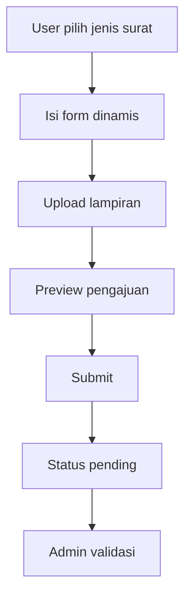
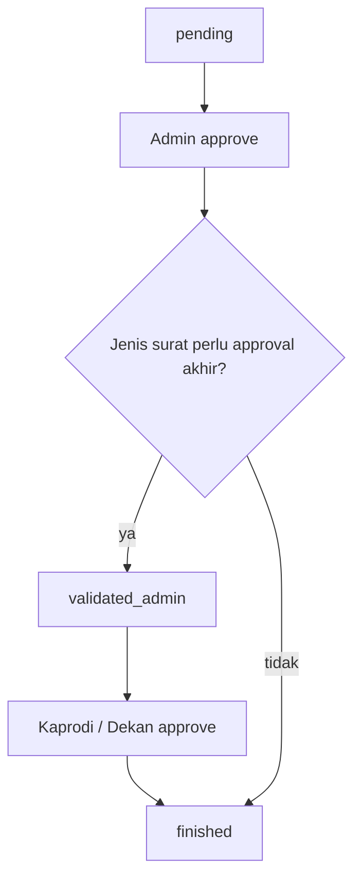
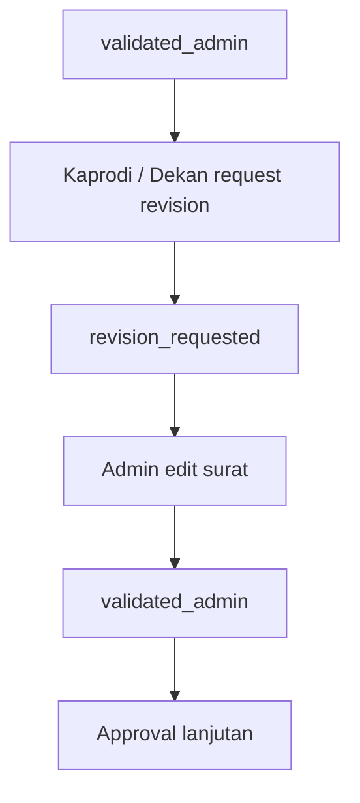
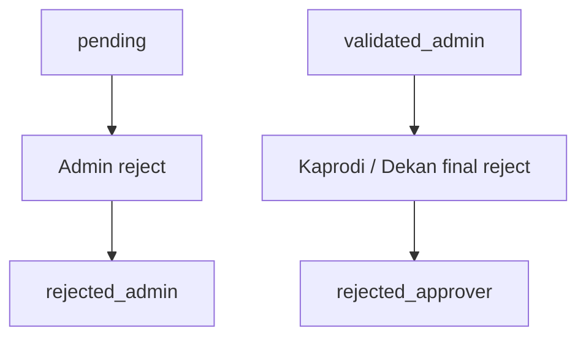
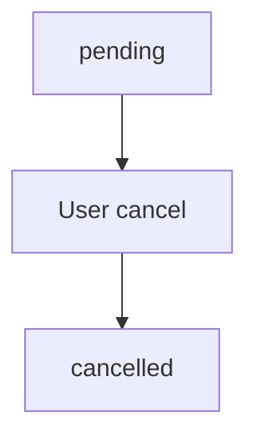
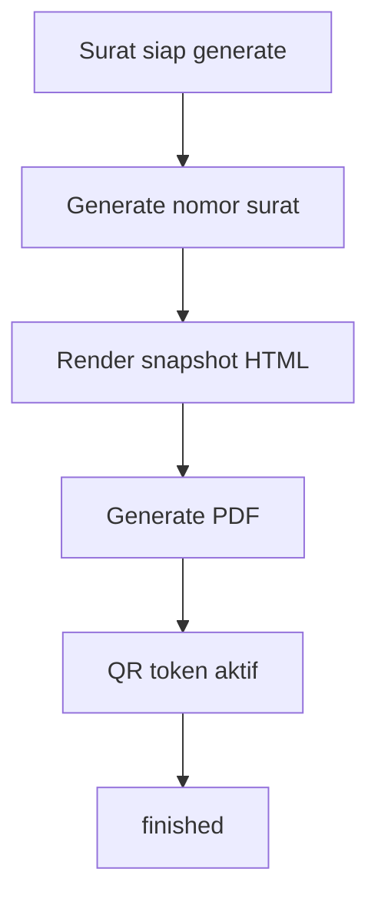

# FAST Discovery Report

Audit ini merangkum struktur FAST pada repository saat ini untuk kebutuhan penyusunan design system lintas modul Portal FMIKOM.

## FAST Overview

FAST di repository ini muncul sebagai `FAST Academic`. Tidak ditemukan definisi kepanjangan formal yang konsisten di kode, tetapi dari struktur route, halaman, dan label UI, FAST berperan sebagai modul layanan akademik dan surat-menyurat di dalam Portal FMIKOM.

Tujuan bisnis FAST:
- memfasilitasi pengajuan surat akademik dan surat keluar
- menyediakan alur validasi, approval, revisi, dan penolakan
- menyediakan preview, PDF generate, serta verifikasi QR
- memberi dashboard dan riwayat proses untuk pemohon, admin, dan approver

Masalah yang diselesaikan FAST:
- pengajuan surat yang sebelumnya tersebar menjadi terpusat
- alur approval manual menjadi terstruktur
- dokumen preview dan hasil generate bisa dilacak
- riwayat proses surat dan keputusan approver terdokumentasi

Aktor utama:
- Mahasiswa
- Dosen
- Kepala Lab
- Sekretaris Fakultas
- Admin
- Kaprodi
- Dekan

Posisi FAST dalam ekosistem Portal FMIKOM:
- FAST adalah modul operasional untuk pengajuan dan persetujuan surat
- WIMS adalah domain lain yang nantinya bisa memakai pola komponen yang sama
- FAST cocok menjadi referensi untuk design system bersama karena memiliki banyak pola data-driven, approval, timeline, document viewer, dan dashboard

---

## FAST Module Map

### 1. Public / Utility

#### QR Verification
- Tujuan: verifikasi keaslian surat via token QR
- Fitur utama: form verifikasi token, hasil verifikasi, detail surat terverifikasi
- Halaman:
  - `resources/js/pages/qr/Index.vue`
  - `resources/js/pages/qr/VerifyForm.vue`
  - `resources/js/pages/qr/VerifyResult.vue`
- Route:
  - `routes/qr_verification.php`

### 2. User Submission Module

#### Mahasiswa / Dosen / Lab / Sekfak
- Tujuan: membuat pengajuan surat
- Fitur utama:
  - pilih jenis surat
  - isi form dinamis
  - upload lampiran
  - preview pengajuan
  - kirim pengajuan
  - lihat dashboard dan riwayat
- Halaman basis:
  - `resources/js/pages/FASt/mahasiswa/Dashboard.vue`
  - `resources/js/pages/FASt/mahasiswa/Ajukan.vue`
  - `resources/js/pages/FASt/mahasiswa/History.vue`
- Wrapper role:
  - `resources/js/pages/FASt/dosen/*`
  - `resources/js/pages/FASt/lab/*`
  - `resources/js/pages/FASt/sekfak/*`
- Controller basis:
  - `app/Http/Controllers/FASt/Shared/User/DashboardController.php`
  - `app/Http/Controllers/FASt/Shared/User/HistoryController.php`
  - `app/Http/Controllers/FASt/Shared/User/SubmissionController.php`

### 3. Admin Submission Module

#### Admin Dashboard / Surat Masuk
- Tujuan: memonitor surat masuk yang masih pending atau revisi
- Fitur utama:
  - ringkasan surat
  - daftar pengajuan terbaru
  - detail surat
  - preview dokumen
  - approval / reject
- Halaman:
  - `resources/js/pages/FASt/admin/dashboard/Index.vue`
  - `resources/js/pages/FASt/admin/dashboard/Show.vue`
- Controller:
  - `app/Http/Controllers/FASt/Admin/DashboardController.php`

#### Admin Surat Keluar
- Tujuan: membuat surat keluar dari sisi admin
- Fitur utama:
  - pilih jenis surat
  - isi form
  - preview
  - simpan
  - edit surat revisi
  - generate PDF
- Halaman:
  - `resources/js/pages/FASt/admin/letters/Create.vue`
  - `resources/js/pages/FASt/admin/letters/Form.vue`
  - `resources/js/pages/FASt/admin/letters/Preview.vue`
  - `resources/js/pages/FASt/admin/letters/Edit.vue`
  - `resources/js/pages/FASt/admin/letters/Index.vue`
- Controller:
  - `app/Http/Controllers/FASt/Admin/LetterController.php`
  - `app/Http/Controllers/FASt/Admin/LetterIndexController.php`

### 4. Approval Module

#### Shared Approval
- Tujuan: menangani approval untuk kaprodi dan dekan
- Fitur utama:
  - queue approval
  - archive approval
  - download surat selesai
  - detail surat
  - approve
  - request revision
  - final reject
  - catatan approval
- Halaman:
  - `resources/js/pages/FASt/Shared/approval/Index.vue`
  - `resources/js/pages/FASt/Shared/approval/Queue.vue`
  - `resources/js/pages/FASt/Shared/approval/Archive.vue`
  - `resources/js/pages/FASt/Shared/approval/Download.vue`
  - `resources/js/pages/FASt/Shared/approval/Show.vue`
- Controller:
  - `app/Http/Controllers/FASt/Shared/Approval/ApprovalController.php`
  - wrapper role:
    - `app/Http/Controllers/FASt/Kaprodi/ApprovalController.php`
    - `app/Http/Controllers/FASt/Dekan/ApprovalController.php`
    - `app/Http/Controllers/FASt/Admin/ApprovalController.php`

### 5. Archive / History / Tracking

#### Admin Archive
- Tujuan: arsip surat selesai dan surat terkait proses lain
- Fitur utama:
  - filter status
  - detail surat arsip
  - preview dan download
- Halaman:
  - `resources/js/pages/FASt/admin/archive/Index.vue`
  - `resources/js/pages/FASt/admin/history/Index.vue`
- Controller:
  - `app/Http/Controllers/FASt/Admin/ArchiveController.php`
  - `app/Http/Controllers/FASt/Admin/HistoryController.php`

#### User History
- Tujuan: melihat riwayat pengajuan surat milik pemohon
- Fitur utama:
  - timeline status
  - preview dokumen
  - download PDF
  - cancel pending submission
- Halaman:
  - `resources/js/pages/FASt/mahasiswa/History.vue`
  - wrapper:
    - `resources/js/pages/FASt/dosen/History.vue`
    - `resources/js/pages/FASt/lab/History.vue`
    - `resources/js/pages/FASt/sekfak/History.vue`
- Controller:
  - `app/Http/Controllers/FASt/Shared/User/HistoryController.php`

### 6. Template Module

#### Template Surat
- Tujuan: menyusun template surat, komponen isi, field dinamis, dan layout render
- Fitur utama:
  - kelola jenis surat
  - builder isi surat
  - field dinamis
  - placeholder
  - pengaturan kop dan footer
  - preview template
- Halaman:
  - `resources/js/pages/FASt/admin/templates/Index.vue`
- Controller:
  - `app/Http/Controllers/FASt/Admin/TemplateController.php`

### 7. Category Module

#### Kategori Surat
- Tujuan: klasifikasi jenis surat
- Fitur utama:
  - tambah, ubah, hapus kategori
  - urutan kategori
- Halaman:
  - `resources/js/pages/FASt/admin/categories/Index.vue`
- Controller:
  - `app/Http/Controllers/FASt/Admin/CategoryController.php`

### 8. QR Management Module

#### QR Code Admin
- Tujuan: memantau dan mencabut QR code surat
- Fitur utama:
  - daftar QR aktif
  - preview dokumen
  - revoke QR
- Halaman:
  - `resources/js/pages/qr/Index.vue`
  - `resources/js/pages/qr/VerifyForm.vue`
  - `resources/js/pages/qr/VerifyResult.vue`
- Controller:
  - `app/Http/Controllers/FASt/Admin/QrManageController.php`

### 9. Global Settings Module

#### Setting Template Global
- Tujuan: mengatur parameter global kop, footer, font, dan format surat
- Fitur utama:
  - kode nomor surat
  - font kop/body/footer
  - logo kop
  - layout kop/footer
  - warna primer
- Controller:
  - `app/Http/Controllers/FASt/Admin/GlobalSettingsController.php`

---

## Workflow Map

### Workflow 1 - Pengajuan Surat oleh Mahasiswa/Dosen/Lab/Sekfak

Penjelasan:
- workflow ini dipakai untuk surat pengajuan user
- data disimpan ke `surats`, `surat_data`, `surat_lampirans`, dan `surat_histories`
- status awal selalu `pending`

### Workflow 2 - Validasi Admin dan Approval Lanjutan

Penjelasan:
- admin memvalidasi surat terlebih dahulu
- jika jenis surat membutuhkan approval akhir, status menjadi `validated_admin`
- jika tidak butuh approval akhir, dokumen bisa langsung digenerate hingga `finished`

### Workflow 3 - Revisi dan Penolakan

Penjelasan:
- revisi hanya terjadi pada alur approval akhir
- admin mengedit surat yang dikembalikan lalu mengirim ulang
- penolakan admin dan penolakan approver dibedakan

### Workflow 4 - Cancel Surat oleh Pemohon

Penjelasan:
- hanya surat yang masih `pending` yang dapat dibatalkan pemohon

### Workflow 5 - Generate Dokumen dan QR

Penjelasan:
- `prepareDraft()` membentuk nomor surat dan snapshot HTML
- `generate()` menghasilkan PDF final dan menyimpan `rendered_snapshot`
- QR aktif ketika dokumen selesai digenerate

---

## Status Map

### Status Surat

| Status | Arti | Digunakan Pada |
| ------ | ---- | -------------- |
| `pending` | Surat baru diajukan dan menunggu validasi admin | `Surat`, dashboard user, dashboard admin, approval guard |
| `validated_admin` | Surat sudah divalidasi admin dan siap ke approval akhir / draft siap | `Surat`, approval queue, workflow generate draft |
| `revision_requested` | Surat dikembalikan oleh kaprodi/dekan untuk diperbaiki admin | `Surat`, history user, detail admin, approval shared |
| `approved_kaprodi` | Surat disetujui kaprodi | `Surat`, dashboard user, approval shared |
| `approved_dekan` | Surat disetujui dekan | `Surat`, dashboard user, approval shared |
| `finished` | Surat selesai, PDF final tersedia | `Surat`, history, download, QR, preview PDF |
| `rejected_admin` | Surat ditolak oleh admin | `Surat`, dashboard user, history, admin approval |
| `rejected_approver` | Surat ditolak final oleh kaprodi/dekan | `Surat`, dashboard user, history, admin approval |
| `cancelled` | Surat dibatalkan oleh pemohon saat masih pending | `Surat`, history user, dashboard user |

### Status Approval Flow

| Status | Arti | Digunakan Pada |
| ------ | ---- | -------------- |
| `approved` | Approval disetujui | `SuratApprovalFlow`, timeline approval |
| `revision_requested` | Diminta revisi | `SuratApprovalFlow`, revisi admin |
| `rejected_final` | Ditolak final | `SuratApprovalFlow`, penolakan admin/approver |
| `note` | Catatan approval | `SuratApprovalFlow`, timeline catatan |

### Status UI yang sering muncul di frontend

| Label UI | Sumber Status |
| -------- | ------------- |
| Menunggu Validasi | `pending` |
| Sudah Divalidasi | `validated_admin`, `approved_kaprodi`, `approved_dekan`, `finished` |
| Sedang Direvisi | `revision_requested` |
| Ditolak | `rejected_admin`, `rejected_approver` |
| Dibatalkan | `cancelled` |

---

## Design System Notes

Implikasi untuk design system lintas WIMS dan FAST:
- FAST sangat kuat di pola `table`, `timeline`, `document viewer`, dan `approval state`
- FAST butuh komponen reusable untuk:
  - status badge
  - stepper / timeline
  - document preview modal
  - empty state
  - filter bar
  - detail panel dengan action button
- FAST juga cocok menjadi referensi untuk:
  - kartu statistik dashboard
  - navigasi role-based
  - formulir data-driven

